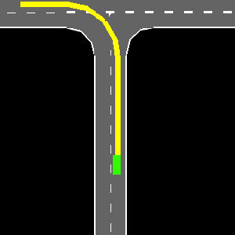
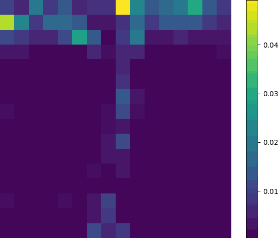
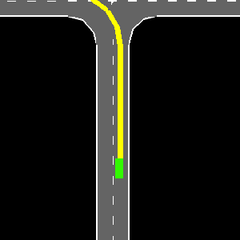
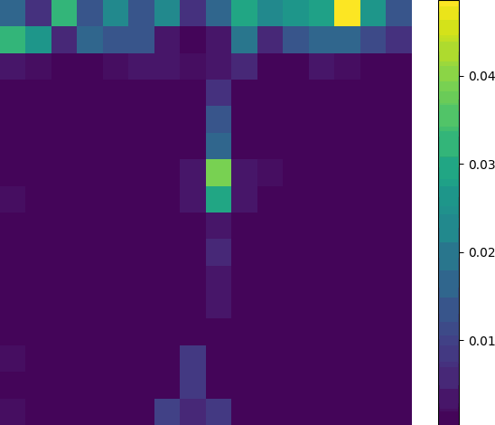

<div align="center">
<h3>Unified Planning Framework with Drivable Area Attention Extraction for <br> Autonomous Driving in Urban Scenarios</h3>

Siyuan Chen , Li Yang , Zihao Mao, Mingyu Hou , Liu He , and Wenjie Song

[**[IEEE Xplore]**](https://ieeexplore.ieee.org/document/10993315/)

IEEE ROBOTICS AND AUTOMATION LETTERS, JULY 2025

</div>

The diversity of urban traffic scenarios poses challenges in stability and generalization for autonomous driving. To tackle this issue, this letter proposes a hierarchical decision-making and planning framework based on reinforcement learning, which employs a unified drivable area cross-attention extraction mechanism, effectively transforming behavioral decisions within intricate and varied driving scenarios into a streamlined process of identifying and selecting optimal drivable areas. Firstly, the target drivable area is represented by lane gaps, and a segmentation network is designed to reduce the complexity of manual coordinate extraction. Secondly, the bird's-eye view of ego vehicle and lane gaps features are feature encoded respectively, and the cross attention between the two components is extracted. Subsequently, attention features are further fused with ego vehicle states. This refined information is then used within a reinforcement learning network to facilitate learning and feedback of vehicle speed and target position. Ultimately, To ensure vehicle safety and precise execution of decisions, an iterative optimization method is used to generate execution trajectories. Comparative simulations demonstrate promising performance of the proposed method, with a success rate greater than 93.3\% in different scenarios, including expressway, merge and intersection, and are improved by 48.8\% compared to different environmental characterization methods. Benchmark comparisons and ablation studies are conducted to fully validate the merits of our method.

<div style="display: flex; justify-content: center; align-items: center; gap: 2%;", align="center">

  

</div>


## To Do List

The code is under cleaning and will be released gradually. [Coming Soon] 🚀

- [ ] training code
- [x] initial repo & paper

## Table of Contents

- [Video Presentation](#video-presentation)
- [Method](#method)

## Video Presentation

- Attention weights of Unified Arivable Area in different scenarios

<div style="display: flex; justify-content: center; align-items: center; gap: 2%;", align="center">
  
  
</div>
<br>
<div style="display: flex; justify-content: center; align-items: center; gap: 2%;", align="center">
  
  
</div>

## Method

<div align="center">
  <image src="assets/framework.png" width=75%>
</div>

## Bibtex

If you find our code and paper can help, please cite our paper as:
```
@article{chen2025unified,
  title={Unified Planning Framework with Drivable Area Attention Extraction for Autonomous Driving in Urban Scenarios},
  author={Chen, Siyuan and Yang, Li and Mao, Zihao and Hou, Mingyu and He, Liu and Song, Wenjie},
  journal={IEEE Robotics and Automation Letters},
  year={2025},
  publisher={IEEE}
}
```
