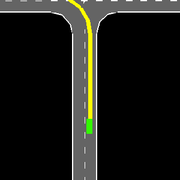
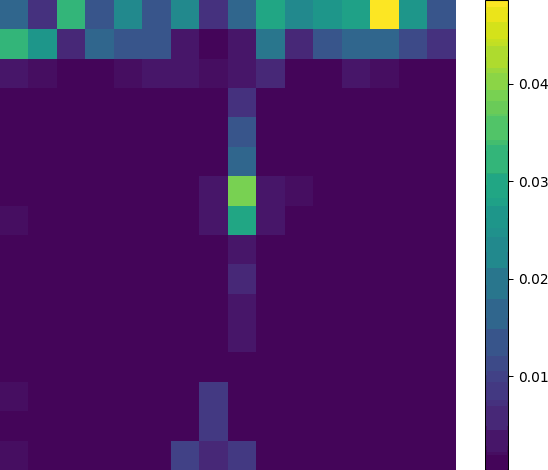

# UDAAE_RL

## Unified Planning Framework with Drivable Area Attention Extraction for Autonomous Driving in Urban Scenarios
The diversity of urban traffic scenarios poses challenges for autonomous driving. Confronted with numerous unpredictable and uncertain behaviors of participants, autonomous vehicles struggle to capture dynamic characteristics, resulting in instability and limited generalization of the decision-making and planning system. To tackle this issue, this paper proposes a hierarchical decision-making and planning framework based on reinforcement learning, which employs a unified drivable area cross-attention extraction mechanism, effectively transforming behavioral decisions within intricate and varied driving scenarios into a streamlined process of identifying and selecting optimal drivable areas. 
Firstly, the target drivable area is represented by lane gaps, and a segmentation network for target area extraction is designed to reduce the complexity of manual coordinate extraction.
Secondly, the bird's-eye view of ego vehicle and lane gaps features are feature encoded respectively, and the cross attention between the two two components is extracted. Subsequently, attention features are further fused with ego vehicle states.
This refined information is then utilized within a reinforcement learning network to facilitate the learning and feedback of vehicle speed and target position. Ultimately, To ensure vehicle safety and precise execution of decisions, an iterative optimization method is used to generate execution trajectories. Comparative simulations demonstrate promising performance of the proposed method, with a success rate over 90\% in different scenarios including highway, merge, and intersection, and is improved by 45.2\% compared to different environment characterization methods. Benchmark comparisons and ablation studies are conducted to fully validate the merits of our method.

### Video:

- UDAE_RL Test in different scenarios

    

- Attention weights of Unified Arivable Area in different scenarios

    

        
    

    

        
    

 

    

        
    

    

        
    

### Source codes will be public available upon acceptance.
